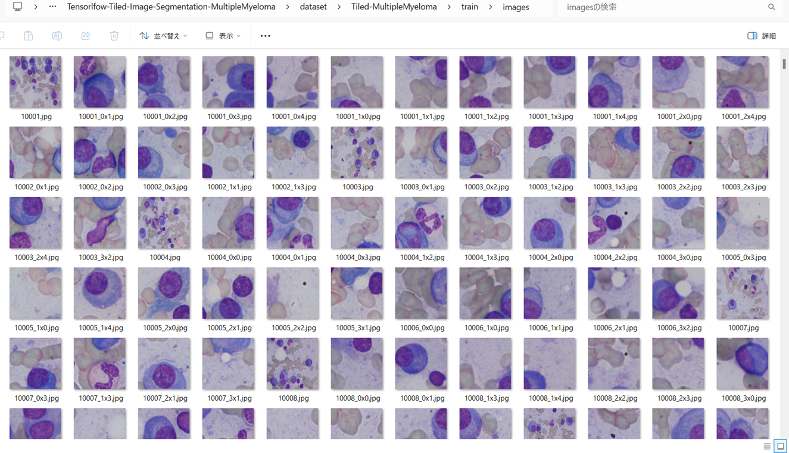
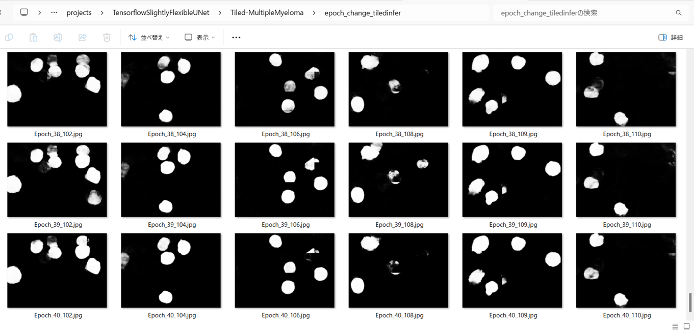
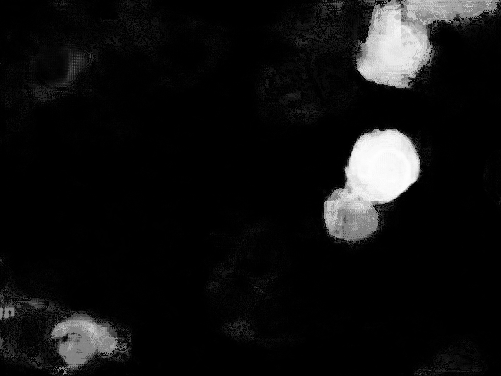

<h2>Tensorflow-Tiled-Image-Segmentation-MultipleMyeloma-2 (2025/04/23)</h2>

Sarah T. Arai 
Software Laboratory antillia.com
  
This is the third experiment of Tiled Image Segmentation for Tiled-MultipleMyeloma
 based on 
the latest <a href="https://github.com/sarah-antillia/Tensorflow-Image-Segmentation-API">Tensorflow-Image-Segmentation-API</a>, 
and a tiled dataset <a href="https://drive.google.com/file/d/105Ppwc5X92_qJhreS1NWUx1-DaCuQd6I/view?usp=sharing">
Tiled-MultipleMyeloma-ImageMask-Dataset.zip</a>, which was derived by us from
<a href="https://segpc-2021.grand-challenge.org/">
Segmentation of Multiple Myeloma Plasma Cells in Microscopic Images (SegPC-2021) 
</a>
 
 
Please see also our experiments: 
<li><a href="https://github.com/sarah-antillia/Tensorflow-Tiled-Image-Segmentation-MultipleMyeloma">
Tensorflow-Tiled-Image-Segmentation-MultipleMyeloma</a></li>
<li><a href="https://github.com/sarah-antillia/Tensorflow-Tiled-Image-Segmentation-Augmented-MultipleMyeloma">
Tensorflow-Tiled-Image-Segmentation-Augmented-MultipleMyeloma</a></li>

 
<b>Experiment Strategies</b> 
In this experiment, we employed the following strategies.
 
<b>1. Tiled ImageMask Dataset</b> 
We trained and validated a TensorFlow UNet model using the Tiled-MultipleMyeloma-ImageMask-Dataset, which was tiledly-splitted to 512x512 pixels image and mask dataset from the original 2560x1920 pixels images and mask files. 
 

<b>2. Tiled Image Segmentation</b> 
We applied our Tiled-Image Segmentation inference method to predict the HardExudates regions for the mini_test images 
with a resolution of 2560x1920 pixels.  

<b>Actual Tiled Image Segmentation for Images of 2560x1920 pixels</b> 
As shown below, the inferred masks look similar to the ground truth masks.  

<table>
<tr>
<th>Input: image</th>
<th>Mask (ground_truth)</th>
<th>Prediction: inferred_mask</th>
</tr>
<tr>
<td></td>
<td></td>
<td></td>
</tr>

<tr>
<td></td>
<td></td>
<td></td>
</tr>

<tr>
<td></td>
<td></td>
<td></td>
</tr>

</table>

 
In this experiment, we used the simple UNet Model 
<a href="./src/TensorflowUNet.py">TensorflowSlightlyFlexibleUNet</a> for this Tiled-MultipleMyelomaSegmentation Model. 
As shown in <a href="https://github.com/sarah-antillia/Tensorflow-Image-Segmentation-API">Tensorflow-Image-Segmentation-API</a>.
you may try other Tensorflow UNet Models: 

<li><a href="./src/TensorflowSwinUNet.py">TensorflowSwinUNet.py</a></li>
<li><a href="./src/TensorflowMultiResUNet.py">TensorflowMultiResUNet.py</a></li>
<li><a href="./src/TensorflowAttentionUNet.py">TensorflowAttentionUNet.py</a></li>
<li><a href="./src/TensorflowEfficientUNet.py">TensorflowEfficientUNet.py</a></li>
<li><a href="./src/TensorflowUNet3Plus.py">TensorflowUNet3Plus.py</a></li>
<li><a href="./src/TensorflowDeepLabV3Plus.py">TensorflowDeepLabV3Plus.py</a></li>

 

<h3>1. Dataset Citation</h3>
The original dataset used here has been take from the following web site:
 
<b>SegPC-2021-dataset</b> 
SegPC-2021: Segmentation of Multiple Myeloma Plasma Cells in Microscopic Images 
https://www.kaggle.com/datasets/sbilab/segpc2021dataset 
 
<b>Citation:</b> 

Anubha Gupta, Ritu Gupta, Shiv Gehlot, Shubham Goswami, April 29, 2021, "SegPC-2021: Segmentation of Multiple Myeloma Plasma Cells  
in Microscopic Images", IEEE Dataport, doi: https://dx.doi.org/10.21227/7np1-2q42. 
 
<b>BibTex</b> 
@data{segpc2021, 
doi = {10.21227/7np1-2q42}, 
url = {https://dx.doi.org/10.21227/7np1-2q42}, 
author = {Anubha Gupta; Ritu Gupta; Shiv Gehlot; Shubham Goswami }, 
publisher = {IEEE Dataport}, 
title = {SegPC-2021: Segmentation of Multiple Myeloma Plasma Cells in Microscopic Images}, 
year = {2021} } 
 
<b>IMPORTANT:</b> 
If you use this dataset, please cite below publications- 
1. Anubha Gupta, Rahul Duggal, Shiv Gehlot, Ritu Gupta, Anvit Mangal, Lalit Kumar, Nisarg Thakkar, and Devprakash Satpathy,  
 "GCTI-SN: Geometry-Inspired Chemical and Tissue Invariant Stain Normalization of Microscopic Medical Images,"  
 Medical Image Analysis, vol. 65, Oct 2020. DOI:  
 (2020 IF: 11.148) 
2. Shiv Gehlot, Anubha Gupta and Ritu Gupta,  
 "EDNFC-Net: Convolutional Neural Network with Nested Feature Concatenation for Nuclei-Instance Segmentation," 
 ICASSP 2020 - 2020 IEEE International Conference on Acoustics, Speech and Signal Processing (ICASSP),  
 Barcelona, Spain, 2020, pp. 1389-1393. 
3. Anubha Gupta, Pramit Mallick, Ojaswa Sharma, Ritu Gupta, and Rahul Duggal,  
 "PCSeg: Color model driven probabilistic multiphase level set based tool for plasma cell segmentation in multiple myeloma,"  
 PLoS ONE 13(12): e0207908, Dec 2018. DOI: 10.1371/journal.pone.0207908 
 
<b>License</b> 
CC BY-NC-SA 4.0
 
 
<h3>
<a id="2">
2 Tiled-MultipleMyelomaImageMask Dataset
</a>
</h3>
 If you would like to train this Tiled-MultipleMyelomaSegmentation model by yourself,
 please download the dataset from the google drive  
<a href="https://drive.google.com/file/d/105Ppwc5X92_qJhreS1NWUx1-DaCuQd6I/view?usp=sharing">
Tiled-MultipleMyeloma-ImageMask-Dataset.zip</a>,
 expand the downloaded ImageMaskDataset and put it under <b>./dataset</b> folder to be
<pre>
./dataset
└─Tiled-MultipleMyeloma
    ├─test
    │   ├─images
    │   └─masks
    ├─train
    │   ├─images
    │   └─masks
    └─valid
        ├─images
        └─masks
</pre>
This is a 512x512 pixels tiles dataset generated from 2560x1920 pixels <b>original images</b> and
their corresponding <b>masks</b>. 
. 
On the derivation of this tiled dataset, please refer to the following Python scripts. 
<a href="https://github.com/sarah-antillia/Tiled-ImageMask-Dataset-MultipleMyeloma">Tiled-ImageMask-Dataset-MultipleMyeloma</a>
 

 
<b>Tiled-MultipleMyeloma-Statistics</b> 
 
 
As shown above, the number of images of train and valid datasets is enough 
to use for a training set of our segmentation model.  
 
<b>Train_images_sample</b> 

 
<b>Train_masks_sample</b> 

 

<h3>
3 Train TensorflowUNet Model
</h3>
 We have trained Tiled-MultipleMyelomaTensorflowUNet Model by using the following
<a href="./projects/TensorflowSlightlyFlexibleUNet/Tiled-MultipleMyeloma/train_eval_infer.config"> <b>train_eval_infer.config</b></a> file.  
Please move to ./projects/TensorflowSlightlyFlexibleUNet/Tiled-MultipleMyelomaand run the following bat file. 
<pre>
>1.train.bat
</pre>
, which simply runs the following command. 
<pre>
>python ../../../src/TensorflowUNetTrainer.py ./train_eval_infer.config
</pre>

<b>Model parameters</b> 
Enabled Batch Normalization. 
Defined a small <b>base_filters=16</b> and large <b>base_kernels=(9,9)</b> for the first Conv Layer of Encoder Block of 
<a href="./src/TensorflowUNet.py">TensorflowUNet.py</a> 
and a large num_layers (including a bridge between Encoder and Decoder Blocks).
<pre>
[model]
base_filters   = 16
base_kernels   = (9,9)
num_layers     = 8
dilation       = (1,1)
</pre>

<b>Learning rate</b> 
Defined a small learning rate.  
<pre>
[model]
learning_rate  = 0.0001
</pre>

<b>Online augmentation</b> 
Disabled our online augmentation tool. 
<pre>
[model]
model         = "TensorflowUNet"
generator     = False
</pre>

<b>Loss and metrics functions</b> 
Specified "bce_dice_loss" and "dice_coef". 
<pre>
[model]
loss           = "bce_dice_loss"
metrics        = ["dice_coef"]
</pre>
<b >Learning rate reducer callback</b> 
Enabled learing_rate_reducer callback, and a small reducer_patience.
<pre> 
[train]
learning_rate_reducer = True
reducer_factor     = 0.5
reducer_patience   = 4
</pre>

<b>Dataset class</b> 
Specified ImageMaskDataset class.
<pre>
[dataset]
datasetclass  = "ImageMaskDataset"
resize_interpolation = "cv2.INTER_CUBIC"
</pre>

<b>Early stopping callback</b> 
Enabled early stopping callback with patience parameter.
<pre>
[train]
patience      = 10
</pre>

<b>Epoch change inference callbacks</b> 
Enabled epoch_change_infer callback. 
<pre>
[train]

epoch_change_infer      = False
epoch_change_infer_dir  = "./epoch_change_infer"
epoch_change_tiledinfer = True
epoch_change_tiledinfer_dir = "./epoch_change_tiledinfer"
num_infer_images       = 6
</pre>

By using this callback, on every epoch_change, the epoch change tiledinfer procedure can be called
 for 6 image in <b>mini_test</b> folder. This will help you confirm how the predicted mask changes 
 at each epoch during your training process.    

<b>Epoch_change_inference output at starting (1,2,3)</b> 
 
 
 
<b>Epoch_change_inference output at ending (38,39,40)</b> 
 
 
 

In this experiment, the training process was stopped at epoch 40 by EarlyStopping Callback.  
 
 

<a href="./projects/TensorflowSlightlyFlexibleUNet/Tiled-MultipleMyeloma/eval/train_metrics.csv">train_metrics.csv</a> 
 

 
<a href="./projects/TensorflowSlightlyFlexibleUNet/Tiled-MultipleMyeloma/eval/train_losses.csv">train_losses.csv</a> 
 

 

<h3>
4 Evaluation
</h3>
Please move to a <b>./projects/TensorflowSlightlyFlexibleUNet/Tiled-MultipleMyeloma</b> folder, 
and run the following bat file to evaluate TensorflowUNet model for Tiled-MultipleMyeloma. 
<pre>
./2.evaluate.bat
</pre>
This bat file simply runs the following command.
<pre>
python ../../../src/TensorflowUNetEvaluator.py ./train_eval_infer_aug.config
</pre>

Evaluation console output: 

  Image-Segmentation-Tiled-MultipleMyeloma

<a href="./projects/TensorflowSlightlyFlexibleUNet/Tiled-MultipleMyeloma/evaluation.csv">evaluation.csv</a> 

The loss (bce_dice_loss) to this Tiled-MultipleMyeloma/test was not low, and dice_coef not high as shown below.
 
<pre>
loss,0.2784
dice_coef,0.7115
</pre>
 

<h3>
5 Tiled inference
</h3>
Please move to a <b>./projects/TensorflowSlightlyFlexibleUNet/Tiled-MultipleMyeloma</b> folder 
,and run the following bat file to infer segmentation regions for images by the Trained-TensorflowUNet model for Tiled-MultipleMyeloma. 
<pre>
./4.tiled_infer.bat
</pre>
This simply runs the following command.
<pre>
python ../../../src/TensorflowUNetTiledInferencer.py ./train_eval_infer.config
</pre>

<b>mini_test_images (2560x1920 pixels)</b> 
 
<b>mini_test_mask(ground_truth)</b> 
 

<b>Tiled inferred test masks (2560x1920 pixels)</b> 
 
 

<b>Enlarged images and masks of 2560x1920 pixels</b> 

<table>
<tr>
<th>Image</th>
<th>Mask (ground_truth)</th>
<th>Tiled-inferred-mask</th>
</tr>

<tr>
<td></td>
<td></td>
<td></td>
</tr>
<tr>
<td></td>
<td></td>
<td></td>
</tr>
<tr>
<td></td>
<td></td>
<td></td>
</tr>
<tr>
<td></td>
<td></td>
<td></td>
</tr>
<tr>
<td></td>
<td></td>
<td></td>
</tr>
<tr>
<td></td>
<td></td>
<td></td>
</tr>
<tr>
<td></td>
<td></td>
<td></td>
</tr>
</table>

 

<h3>
References
</h3>
<b>1. IDRiD: Diabetic Retinopathy – Segmentation and Grading Challenge</b> 
Prasanna Porwal
, 
Samiksha Pachade, Manesh Kokare, Girish Deshmukh, Jaemin Son, Woong Bae, Lihong Liu 
, Jianzong Wang, Xinhui Liu, Liangxin Gao, TianBo Wu, Jing Xiao, Fengyan Wang , 
Baocai Yin, Yunzhi Wang, Gopichandh Danala, Linsheng He, Yoon Ho Choi, Yeong Chan Lee 
, Sang-Hyuk Jung,Fabrice Mériaudeau 
 

DOI:<a href="https://doi.org/10.1016/j.media.2019.101561">https://doi.org/10.1016/j.media.2019.101561</a>

 
<a href="https://www.sciencedirect.com/science/article/abs/pii/S1361841519301033">
https://www.sciencedirect.com/science/article/abs/pii/S1361841519301033</a>
 
 

<b>2. Tensorflow-Tiled-Image-Segmentation-Augmented-Skin-Cancer</b> 

Toshiyuki Arai @antillia.com 
<a href="https://github.com/sarah-antillia/Tensorflow-Tiled-Image-Segmentation-Augmented-Skin-Cancer">
https://github.com/sarah-antillia/Tensorflow-Tiled-Image-Segmentation-Augmented-Skin-Cancer
</a>
 
 
<b>3. Tensorflow-Tiled-Image-Segmentation-Augmented-MultipleMyeloma</b> 
Toshiyuki Arai @antillia.com 
<a href="https://github.com/sarah-antillia/Tensorflow-Tiled-Image-Segmentation-Augmented-MultipleMyeloma">
https://github.com/sarah-antillia/Tensorflow-Tiled-Image-Segmentation-Augmented-MultipleMyeloma
</a>
 
 

<b>4. Tiled-ImageMask-Dataset-Breast-Cancer</b> 
Toshiyuki Arai @antillia.com 
<a href="https://github.com/sarah-antillia/Tiled-ImageMask-Dataset-Breast-Cancer">
https://github.com/sarah-antillia/Tiled-ImageMask-Dataset-Breast-Cancer
</a>
 
 

